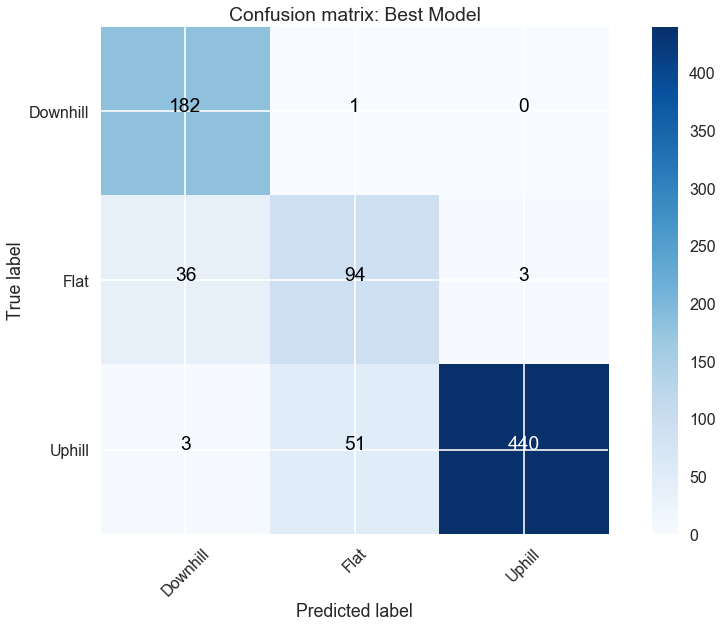
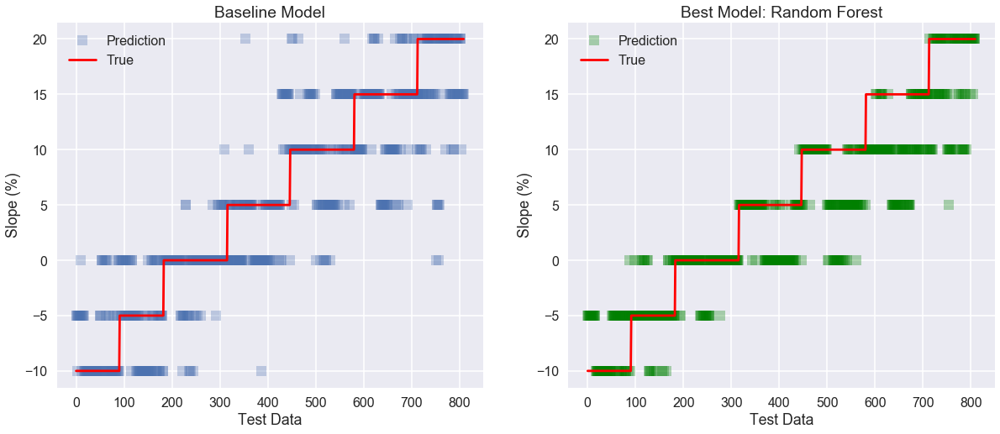
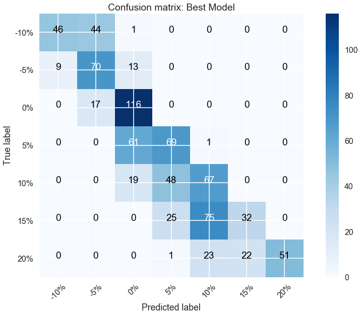
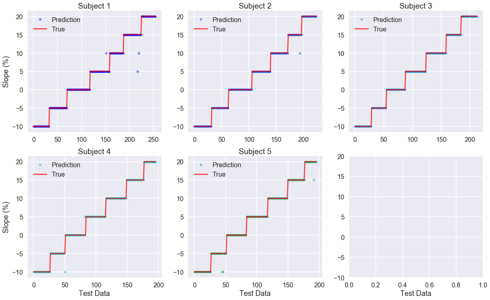
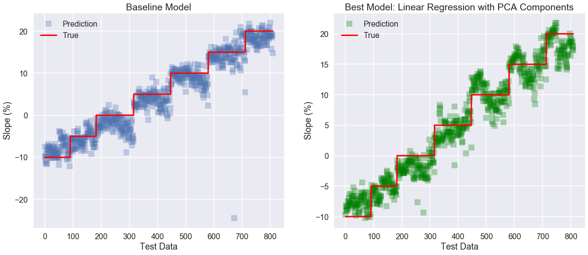
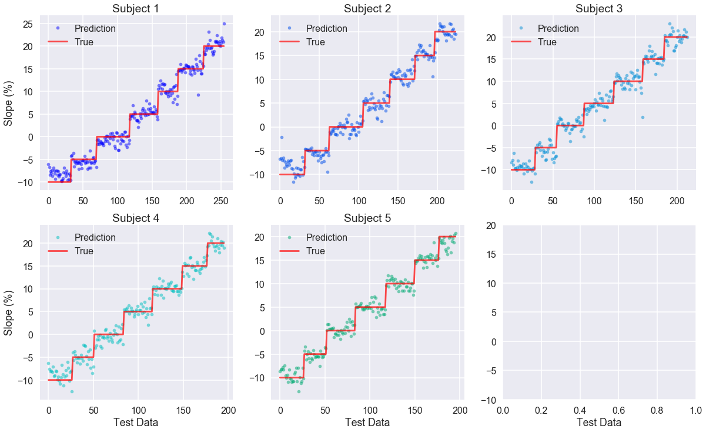

## Contents
{:.no_toc}
*  
{: toc}


By using 2 thigh IMUs and 1 torso imu, we could achieve 90.5% . 
Classification into 7 classes VS regression: Regression model showed better performance 
By building subject specific models, we can achieve very accurate model. Interestingly, classification into 7 classes showed better performance over regression for subject specific model.


Best models, performance measures for each case

- Classification into 3 classes: Random Forest, Test Accuracy(90.5%)

- Classification into 7 classes: Random Forest, Test Accuracy(54.2%)

- Regression: Linear Regression (with 90% variance explained PCA components), Test R2 score(0.947), Converted Test Accuracy(75.4%)


For practical implementation, we made subject-specific models for each case 

- Classification into 3 classes: Random Forest, Test Accuracy(99.9%)

- Classification into 7 classes: Random Forest, Test Accuracy(99.2%)

- Regression: Linear Regression (with 90% variance explained PCA components), Converted Test Accuracy(93.0%)


```python

%matplotlib inline

sns.set_context("poster")

! pip install colour
from colour import Color
red = Color("blue")
colors = list(red.range_to(Color("green"),7))
```


    /Users/personalmac/anaconda/lib/python3.6/site-packages/statsmodels/compat/pandas.py:56: FutureWarning: The pandas.core.datetools module is deprecated and will be removed in a future version. Please use the pandas.tseries module instead.
      from pandas.core import datetools


    Requirement already satisfied: colour in /Users/personalmac/anaconda/lib/python3.6/site-packages


### Reading and Cleaning Data


```python
### READING DATA

df = pd.read_csv('dataAll_csv8_withmm.csv')
df["slope_class"] = 0
df["slope_class"][df['ref_slope'] < 0] = -1
df["slope_class"][df['ref_slope'] == 0]= 0
df["slope_class"][df['ref_slope'] > 0]= 1
df = df.drop("ref_speed", axis=1)

```


```python

subject_test = 6;

df_train = df[df['subject_number'] != subject_test]
df_test = df[df['subject_number'] ==subject_test]

```


```python


X_train = df_train.iloc[:, :-2]
y_train = df_train.iloc[:, -1]
y_train_multi = df_train.iloc[:, -2]

X_test = df_test.iloc[:, :-2]
y_test = df_test.iloc[:, -1]
y_test_multi = df_test.iloc[:, -2]


### Remove unnecessary predictors (Time, Angle Z, Accerelation X and Y)

for i in range(df_train.shape[1]):
    if df_train.columns[i] == 'timeGaitExt_L_0':
        break
        
index_unused_features = i


a = 52
X_train = df_train[df_train.columns[a:a+107]].copy()
X_test = df_test[df_test.columns[a:a+107]].copy()
a += 107

while a < index_unused_features:
    
    # IMU data except angle Z, acc X, acc Y 

    if not ((df_train.columns[a].split('_')[0] == 'angleZ') or (df_train.columns[a].split('_')[0] == 'accXRot') or (df_train.columns[a].split('_')[0] == 'accYRot')):
        X_train = pd.concat([X_train, df_train[df_train.columns[a:a+107]]], axis =1)
        X_test = pd.concat([X_test, df_test[df_test.columns[a:a+107]]], axis =1)

    a += 107
    
X_train = pd.concat([X_train, df_train[df_train.columns[-4:-2]]], axis =1)
X_test = pd.concat([X_test, df_test[df_test.columns[-4:-2]]], axis =1)

subnum_train = df_train[df_train.columns[0]].values
subnum_test = df_test[df_test.columns[0]].values

print("Number of predictors we have: %d" %X_train.shape[1])
```


    Number of predictors we have: 1928


```python
def standardize(x, x_ref):
    mean = np.mean(x_ref);
    std = np.std(x_ref);  

    x_stand = (x - mean)/std;
    return x_stand

X_train_unstand = X_train.copy();
X_train_std = standardize(X_train, X_train_unstand)

X_test_unstand = X_test.copy();
X_test_std = standardize(X_test, X_train_unstand)
```


### Custom Functions


```python
def custom_cv(est_list, X, y, paramlist, subject_nums):    
    # iterate through each parameter with estimators premade
    # subject_list is the same order of df entries
    param_score_list = [];
    for e in est_list:
        
        # iterate through each fold
        fold_score_list = [0]*5;
        subject_list = list(set(subject_nums))
        
        for j, sub_num in enumerate(subject_list):
            valid = subject_nums == sub_num
            train = subject_nums == sub_num
            Xtrain = X[train];
            ytrain = y[train];
            Xvalid = X[valid];
            yvalid = y[valid];
            
            # fit and validate
            e.fit(Xtrain, ytrain)
            fold_score_list[j] = e.score(Xvalid, yvalid)
        
        param_score_list.append(np.mean(fold_score_list))
                    
    i_best = np.argmax(param_score_list)
    
    # fit again on all train data
    best_est = est_list[i_best]
    best_est.fit(X, y)
    
    return paramlist[i_best], param_score_list[i_best], best_est
```


```python
def subject_set(X, y, subject_num):
    X_list = []
    y_list = []
    
    subject_list = list(set(subject_num))
    
    for j, subject in enumerate(subject_list):

        subject_TF = subject_num == subject

        X_list.append(X[subject_TF]);
        y_list.append(y[subject_TF]);

        
    # split into test and train
    
    X_train_list = [None]*len(subject_list);
    X_test_list = [None]*len(subject_list);

    y_train_list = [None]*len(subject_list);
    y_test_list = [None]*len(subject_list);

    for j in range(0, len(X_list)):
        np.random.seed(9001)
        msk = np.random.rand(len(X_list[j])) < 0.75
        X_train_list[j] = X_list[j][msk]
        X_test_list[j] = X_list[j][~msk]

        y_train_list[j] = y_list[j][msk]
        y_test_list[j] = y_list[j][~msk]
    
    
    return X_train_list, y_train_list, X_test_list, y_test_list
```


```python
def regression_to_classification(y_true, y_pred):

    y_class = np.zeros(len(y_pred))
    
    for i, prediction in enumerate(y_pred):
        if prediction < -7.5:
            y_class[i] = -10
        elif prediction >= -7.5 and prediction < -2.5:
            y_class[i] = -5
        elif prediction >= -2.5 and prediction < 2.5:
            y_class[i] = 0
        elif prediction >= 2.5 and prediction < 7.5:
            y_class[i] = 5
        elif prediction >= 7.5 and prediction < 12.5:
            y_class[i] = 10
        elif prediction >= 12.5 and prediction < 17.5:
            y_class[i] = 15            
        elif prediction >= 17.5:
            y_class[i] = 20            
        
    y_tf = y_class == y_true
    accuracy = np.sum(y_tf) / len(y_true)  
    
    return y_class, accuracy
```


```python
def plot_confusion_matrix(cm, classes,
                          normalize=False,
                          title='Confusion matrix',
                          cmap=plt.cm.Blues):

    if normalize:
        cm = cm.astype('float') / cm.sum(axis=1)[:, np.newaxis]


    plt.imshow(cm, interpolation='nearest', cmap=cmap)
    plt.title(title)
    plt.colorbar()
    tick_marks = np.arange(len(classes))
    plt.xticks(tick_marks, classes, rotation=45)
    plt.yticks(tick_marks, classes)

    fmt = '.2f' if normalize else 'd'
    thresh = cm.max() / 2.
    for i, j in itertools.product(range(cm.shape[0]), range(cm.shape[1])):
        plt.text(j, i, format(cm[i, j], fmt),
                 horizontalalignment="center",
                 color="white" if cm[i, j] > thresh else "black")

    plt.tight_layout()
    plt.ylabel('True label')
    plt.xlabel('Predicted label')
```


### Results
#### 1) Classification into 3 classes (Uphill / Flat / Downhill)

Table: explanation

- Baseline model: plot
- Best model: plot, confusion matrix
- Individual Model: plots


```python

dt_base = DecisionTreeClassifier(max_depth = None)
dt_base.fit(X_train, y_train)

score_base_train = dt_base.score(X_train, y_train)
score_base_test  = dt_base.score(X_test, y_test)

```


```python

n_list = [8, 16, 32, 64];
est_list = [];
for n in n_list:
    rf = RandomForestClassifier(oob_score = True, n_estimators=n, max_features=int(np.sqrt(len(X_train.columns))) , n_jobs=-1)
    est_list.append(rf)
    

best_p, best_score, best_est_rf = custom_cv(est_list, X_train, y_train, n_list, subnum_train)
best_p, best_score
```


    /Users/personalmac/anaconda/lib/python3.6/site-packages/sklearn/ensemble/forest.py:439: UserWarning: Some inputs do not have OOB scores. This probably means too few trees were used to compute any reliable oob estimates.
      warn("Some inputs do not have OOB scores. "
    /Users/personalmac/anaconda/lib/python3.6/site-packages/sklearn/ensemble/forest.py:444: RuntimeWarning: invalid value encountered in true_divide
      predictions[k].sum(axis=1)[:, np.newaxis])
    /Users/personalmac/anaconda/lib/python3.6/site-packages/sklearn/ensemble/forest.py:439: UserWarning: Some inputs do not have OOB scores. This probably means too few trees were used to compute any reliable oob estimates.
      warn("Some inputs do not have OOB scores. "
    /Users/personalmac/anaconda/lib/python3.6/site-packages/sklearn/ensemble/forest.py:444: RuntimeWarning: invalid value encountered in true_divide
      predictions[k].sum(axis=1)[:, np.newaxis])
    /Users/personalmac/anaconda/lib/python3.6/site-packages/sklearn/ensemble/forest.py:439: UserWarning: Some inputs do not have OOB scores. This probably means too few trees were used to compute any reliable oob estimates.
      warn("Some inputs do not have OOB scores. "
    /Users/personalmac/anaconda/lib/python3.6/site-packages/sklearn/ensemble/forest.py:444: RuntimeWarning: invalid value encountered in true_divide
      predictions[k].sum(axis=1)[:, np.newaxis])
    /Users/personalmac/anaconda/lib/python3.6/site-packages/sklearn/ensemble/forest.py:439: UserWarning: Some inputs do not have OOB scores. This probably means too few trees were used to compute any reliable oob estimates.
      warn("Some inputs do not have OOB scores. "
    /Users/personalmac/anaconda/lib/python3.6/site-packages/sklearn/ensemble/forest.py:444: RuntimeWarning: invalid value encountered in true_divide
      predictions[k].sum(axis=1)[:, np.newaxis])
    /Users/personalmac/anaconda/lib/python3.6/site-packages/sklearn/ensemble/forest.py:439: UserWarning: Some inputs do not have OOB scores. This probably means too few trees were used to compute any reliable oob estimates.
      warn("Some inputs do not have OOB scores. "
    /Users/personalmac/anaconda/lib/python3.6/site-packages/sklearn/ensemble/forest.py:444: RuntimeWarning: invalid value encountered in true_divide
      predictions[k].sum(axis=1)[:, np.newaxis])
    /Users/personalmac/anaconda/lib/python3.6/site-packages/sklearn/ensemble/forest.py:439: UserWarning: Some inputs do not have OOB scores. This probably means too few trees were used to compute any reliable oob estimates.
      warn("Some inputs do not have OOB scores. "
    /Users/personalmac/anaconda/lib/python3.6/site-packages/sklearn/ensemble/forest.py:444: RuntimeWarning: invalid value encountered in true_divide
      predictions[k].sum(axis=1)[:, np.newaxis])
    /Users/personalmac/anaconda/lib/python3.6/site-packages/sklearn/ensemble/forest.py:439: UserWarning: Some inputs do not have OOB scores. This probably means too few trees were used to compute any reliable oob estimates.
      warn("Some inputs do not have OOB scores. "
    /Users/personalmac/anaconda/lib/python3.6/site-packages/sklearn/ensemble/forest.py:444: RuntimeWarning: invalid value encountered in true_divide
      predictions[k].sum(axis=1)[:, np.newaxis])
    /Users/personalmac/anaconda/lib/python3.6/site-packages/sklearn/ensemble/forest.py:439: UserWarning: Some inputs do not have OOB scores. This probably means too few trees were used to compute any reliable oob estimates.
      warn("Some inputs do not have OOB scores. "
    /Users/personalmac/anaconda/lib/python3.6/site-packages/sklearn/ensemble/forest.py:444: RuntimeWarning: invalid value encountered in true_divide
      predictions[k].sum(axis=1)[:, np.newaxis])
    /Users/personalmac/anaconda/lib/python3.6/site-packages/sklearn/ensemble/forest.py:439: UserWarning: Some inputs do not have OOB scores. This probably means too few trees were used to compute any reliable oob estimates.
      warn("Some inputs do not have OOB scores. "
    /Users/personalmac/anaconda/lib/python3.6/site-packages/sklearn/ensemble/forest.py:444: RuntimeWarning: invalid value encountered in true_divide
      predictions[k].sum(axis=1)[:, np.newaxis])


    (16, 1.0)


```python
fig, axes = plt.subplots(1,2, figsize=(20,8))
axes = axes.flatten()

axes[0].plot(np.arange(len(y_test)), dt_base.predict(X_test), 's', alpha = 0.3, label = 'Prediction')
axes[0].plot(np.arange(len(y_test)), y_test, 'r-', label = 'True')

axes[0].set_yticks( np.unique(y_test))
axes[0].set_yticklabels(['Downhill', 'Flat', 'Uphill'])

axes[0].set_xlabel("Test Data")
axes[0].set_title('Baseline Model')
axes[0].legend()


axes[1].plot(np.arange(len(y_test)), best_est_rf.predict(X_test), 'gs', alpha = 0.3, label = 'Prediction')
axes[1].plot(np.arange(len(y_test)), y_test, 'r-', label = 'True')

axes[1].set_yticks( np.unique(y_test))
axes[1].set_yticklabels(['Downhill', 'Flat', 'Uphill'])

axes[1].set_xlabel("Test Data")
axes[1].set_title("Best Model: Random Forest")
axes[1].legend()

```


    <matplotlib.legend.Legend at 0x111100470>


```python
class_names = ['Downhill', 'Flat', 'Uphill']

cnf_matrix = confusion_matrix(y_test, best_est_rf.predict(X_test))
np.set_printoptions(precision=2)

plt.figure()
plot_confusion_matrix(cnf_matrix, classes=class_names,
                      title='Confusion matrix: Best Model')

plt.show()
```





### Individual Mode: Random Forest


```python
X_train_list, y_train_list, X_test_list, y_test_list= subject_set(X_train, y_train, subnum_train)

n_list = [2,8, 16, 32, 64]
rf_cv_ind_list = [None] * len(X_train_list)
score_rf_cv_train_list = [None] * len(X_train_list)
score_rf_cv_test_list = [None] * len(X_train_list)

for i in range(len(X_train_list)):

    rf_ind = RandomForestClassifier(oob_score = True, max_features=int(np.sqrt(len(X_train_list[i].columns))) , n_jobs=-1)
    n_est = {'n_estimators': n_list}
    rfGrid_ind  = GridSearchCV(rf_ind, n_est, cv = 5)
    rfGrid_ind.fit(X_train_list[i], y_train_list[i])


    rf_cv_ind = RandomForestClassifier(oob_score = True, n_estimators= rfGrid_ind.best_params_['n_estimators'], 
                                       max_features=int(np.sqrt(len(X_train_list[i].columns))) , n_jobs=-1)
    rf_cv_ind.fit(X_train_list[i], y_train_list[i])
    
    rf_cv_ind_list[i] = rf_cv_ind


    score_rf_cv_train_list[i] = rf_cv_ind.score(X_train_list[i], y_train_list[i])
    score_rf_cv_test_list[i] = rf_cv_ind.score(X_test_list[i], y_test_list[i])

```


    /Users/personalmac/anaconda/lib/python3.6/site-packages/sklearn/ensemble/forest.py:439: UserWarning: Some inputs do not have OOB scores. This probably means too few trees were used to compute any reliable oob estimates.
      warn("Some inputs do not have OOB scores. "
    /Users/personalmac/anaconda/lib/python3.6/site-packages/sklearn/ensemble/forest.py:444: RuntimeWarning: invalid value encountered in true_divide
      predictions[k].sum(axis=1)[:, np.newaxis])
    /Users/personalmac/anaconda/lib/python3.6/site-packages/sklearn/ensemble/forest.py:439: UserWarning: Some inputs do not have OOB scores. This probably means too few trees were used to compute any reliable oob estimates.
      warn("Some inputs do not have OOB scores. "
    /Users/personalmac/anaconda/lib/python3.6/site-packages/sklearn/ensemble/forest.py:444: RuntimeWarning: invalid value encountered in true_divide
      predictions[k].sum(axis=1)[:, np.newaxis])
    /Users/personalmac/anaconda/lib/python3.6/site-packages/sklearn/ensemble/forest.py:439: UserWarning: Some inputs do not have OOB scores. This probably means too few trees were used to compute any reliable oob estimates.
      warn("Some inputs do not have OOB scores. "
    /Users/personalmac/anaconda/lib/python3.6/site-packages/sklearn/ensemble/forest.py:444: RuntimeWarning: invalid value encountered in true_divide
      predictions[k].sum(axis=1)[:, np.newaxis])
    /Users/personalmac/anaconda/lib/python3.6/site-packages/sklearn/ensemble/forest.py:439: UserWarning: Some inputs do not have OOB scores. This probably means too few trees were used to compute any reliable oob estimates.
      warn("Some inputs do not have OOB scores. "
    /Users/personalmac/anaconda/lib/python3.6/site-packages/sklearn/ensemble/forest.py:444: RuntimeWarning: invalid value encountered in true_divide
      predictions[k].sum(axis=1)[:, np.newaxis])
    /Users/personalmac/anaconda/lib/python3.6/site-packages/sklearn/ensemble/forest.py:439: UserWarning: Some inputs do not have OOB scores. This probably means too few trees were used to compute any reliable oob estimates.
      warn("Some inputs do not have OOB scores. "
    /Users/personalmac/anaconda/lib/python3.6/site-packages/sklearn/ensemble/forest.py:444: RuntimeWarning: invalid value encountered in true_divide
      predictions[k].sum(axis=1)[:, np.newaxis])
    /Users/personalmac/anaconda/lib/python3.6/site-packages/sklearn/ensemble/forest.py:439: UserWarning: Some inputs do not have OOB scores. This probably means too few trees were used to compute any reliable oob estimates.
      warn("Some inputs do not have OOB scores. "
    /Users/personalmac/anaconda/lib/python3.6/site-packages/sklearn/ensemble/forest.py:444: RuntimeWarning: invalid value encountered in true_divide
      predictions[k].sum(axis=1)[:, np.newaxis])
    /Users/personalmac/anaconda/lib/python3.6/site-packages/sklearn/ensemble/forest.py:439: UserWarning: Some inputs do not have OOB scores. This probably means too few trees were used to compute any reliable oob estimates.
      warn("Some inputs do not have OOB scores. "
    /Users/personalmac/anaconda/lib/python3.6/site-packages/sklearn/ensemble/forest.py:444: RuntimeWarning: invalid value encountered in true_divide
      predictions[k].sum(axis=1)[:, np.newaxis])
    /Users/personalmac/anaconda/lib/python3.6/site-packages/sklearn/ensemble/forest.py:439: UserWarning: Some inputs do not have OOB scores. This probably means too few trees were used to compute any reliable oob estimates.
      warn("Some inputs do not have OOB scores. "
    /Users/personalmac/anaconda/lib/python3.6/site-packages/sklearn/ensemble/forest.py:444: RuntimeWarning: invalid value encountered in true_divide
      predictions[k].sum(axis=1)[:, np.newaxis])
    /Users/personalmac/anaconda/lib/python3.6/site-packages/sklearn/ensemble/forest.py:439: UserWarning: Some inputs do not have OOB scores. This probably means too few trees were used to compute any reliable oob estimates.
      warn("Some inputs do not have OOB scores. "
    /Users/personalmac/anaconda/lib/python3.6/site-packages/sklearn/ensemble/forest.py:444: RuntimeWarning: invalid value encountered in true_divide
      predictions[k].sum(axis=1)[:, np.newaxis])
    /Users/personalmac/anaconda/lib/python3.6/site-packages/sklearn/ensemble/forest.py:439: UserWarning: Some inputs do not have OOB scores. This probably means too few trees were used to compute any reliable oob estimates.
      warn("Some inputs do not have OOB scores. "
    /Users/personalmac/anaconda/lib/python3.6/site-packages/sklearn/ensemble/forest.py:444: RuntimeWarning: invalid value encountered in true_divide
      predictions[k].sum(axis=1)[:, np.newaxis])
    /Users/personalmac/anaconda/lib/python3.6/site-packages/sklearn/ensemble/forest.py:439: UserWarning: Some inputs do not have OOB scores. This probably means too few trees were used to compute any reliable oob estimates.
      warn("Some inputs do not have OOB scores. "
    /Users/personalmac/anaconda/lib/python3.6/site-packages/sklearn/ensemble/forest.py:444: RuntimeWarning: invalid value encountered in true_divide
      predictions[k].sum(axis=1)[:, np.newaxis])
    /Users/personalmac/anaconda/lib/python3.6/site-packages/sklearn/ensemble/forest.py:439: UserWarning: Some inputs do not have OOB scores. This probably means too few trees were used to compute any reliable oob estimates.
      warn("Some inputs do not have OOB scores. "
    /Users/personalmac/anaconda/lib/python3.6/site-packages/sklearn/ensemble/forest.py:444: RuntimeWarning: invalid value encountered in true_divide
      predictions[k].sum(axis=1)[:, np.newaxis])
    /Users/personalmac/anaconda/lib/python3.6/site-packages/sklearn/ensemble/forest.py:439: UserWarning: Some inputs do not have OOB scores. This probably means too few trees were used to compute any reliable oob estimates.
      warn("Some inputs do not have OOB scores. "
    /Users/personalmac/anaconda/lib/python3.6/site-packages/sklearn/ensemble/forest.py:444: RuntimeWarning: invalid value encountered in true_divide
      predictions[k].sum(axis=1)[:, np.newaxis])
    /Users/personalmac/anaconda/lib/python3.6/site-packages/sklearn/ensemble/forest.py:439: UserWarning: Some inputs do not have OOB scores. This probably means too few trees were used to compute any reliable oob estimates.
      warn("Some inputs do not have OOB scores. "
    /Users/personalmac/anaconda/lib/python3.6/site-packages/sklearn/ensemble/forest.py:444: RuntimeWarning: invalid value encountered in true_divide
      predictions[k].sum(axis=1)[:, np.newaxis])
    /Users/personalmac/anaconda/lib/python3.6/site-packages/sklearn/ensemble/forest.py:439: UserWarning: Some inputs do not have OOB scores. This probably means too few trees were used to compute any reliable oob estimates.
      warn("Some inputs do not have OOB scores. "
    /Users/personalmac/anaconda/lib/python3.6/site-packages/sklearn/ensemble/forest.py:444: RuntimeWarning: invalid value encountered in true_divide
      predictions[k].sum(axis=1)[:, np.newaxis])
    /Users/personalmac/anaconda/lib/python3.6/site-packages/sklearn/ensemble/forest.py:439: UserWarning: Some inputs do not have OOB scores. This probably means too few trees were used to compute any reliable oob estimates.
      warn("Some inputs do not have OOB scores. "
    /Users/personalmac/anaconda/lib/python3.6/site-packages/sklearn/ensemble/forest.py:444: RuntimeWarning: invalid value encountered in true_divide
      predictions[k].sum(axis=1)[:, np.newaxis])
    /Users/personalmac/anaconda/lib/python3.6/site-packages/sklearn/ensemble/forest.py:439: UserWarning: Some inputs do not have OOB scores. This probably means too few trees were used to compute any reliable oob estimates.
      warn("Some inputs do not have OOB scores. "
    /Users/personalmac/anaconda/lib/python3.6/site-packages/sklearn/ensemble/forest.py:444: RuntimeWarning: invalid value encountered in true_divide
      predictions[k].sum(axis=1)[:, np.newaxis])
    /Users/personalmac/anaconda/lib/python3.6/site-packages/sklearn/ensemble/forest.py:439: UserWarning: Some inputs do not have OOB scores. This probably means too few trees were used to compute any reliable oob estimates.
      warn("Some inputs do not have OOB scores. "
    /Users/personalmac/anaconda/lib/python3.6/site-packages/sklearn/ensemble/forest.py:444: RuntimeWarning: invalid value encountered in true_divide
      predictions[k].sum(axis=1)[:, np.newaxis])
    /Users/personalmac/anaconda/lib/python3.6/site-packages/sklearn/ensemble/forest.py:439: UserWarning: Some inputs do not have OOB scores. This probably means too few trees were used to compute any reliable oob estimates.
      warn("Some inputs do not have OOB scores. "
    /Users/personalmac/anaconda/lib/python3.6/site-packages/sklearn/ensemble/forest.py:444: RuntimeWarning: invalid value encountered in true_divide
      predictions[k].sum(axis=1)[:, np.newaxis])
    /Users/personalmac/anaconda/lib/python3.6/site-packages/sklearn/ensemble/forest.py:439: UserWarning: Some inputs do not have OOB scores. This probably means too few trees were used to compute any reliable oob estimates.
      warn("Some inputs do not have OOB scores. "
    /Users/personalmac/anaconda/lib/python3.6/site-packages/sklearn/ensemble/forest.py:444: RuntimeWarning: invalid value encountered in true_divide
      predictions[k].sum(axis=1)[:, np.newaxis])
    /Users/personalmac/anaconda/lib/python3.6/site-packages/sklearn/ensemble/forest.py:439: UserWarning: Some inputs do not have OOB scores. This probably means too few trees were used to compute any reliable oob estimates.
      warn("Some inputs do not have OOB scores. "
    /Users/personalmac/anaconda/lib/python3.6/site-packages/sklearn/ensemble/forest.py:444: RuntimeWarning: invalid value encountered in true_divide
      predictions[k].sum(axis=1)[:, np.newaxis])
    /Users/personalmac/anaconda/lib/python3.6/site-packages/sklearn/ensemble/forest.py:439: UserWarning: Some inputs do not have OOB scores. This probably means too few trees were used to compute any reliable oob estimates.
      warn("Some inputs do not have OOB scores. "
    /Users/personalmac/anaconda/lib/python3.6/site-packages/sklearn/ensemble/forest.py:444: RuntimeWarning: invalid value encountered in true_divide
      predictions[k].sum(axis=1)[:, np.newaxis])
    /Users/personalmac/anaconda/lib/python3.6/site-packages/sklearn/ensemble/forest.py:439: UserWarning: Some inputs do not have OOB scores. This probably means too few trees were used to compute any reliable oob estimates.
      warn("Some inputs do not have OOB scores. "
    /Users/personalmac/anaconda/lib/python3.6/site-packages/sklearn/ensemble/forest.py:444: RuntimeWarning: invalid value encountered in true_divide
      predictions[k].sum(axis=1)[:, np.newaxis])
    /Users/personalmac/anaconda/lib/python3.6/site-packages/sklearn/ensemble/forest.py:439: UserWarning: Some inputs do not have OOB scores. This probably means too few trees were used to compute any reliable oob estimates.
      warn("Some inputs do not have OOB scores. "
    /Users/personalmac/anaconda/lib/python3.6/site-packages/sklearn/ensemble/forest.py:444: RuntimeWarning: invalid value encountered in true_divide
      predictions[k].sum(axis=1)[:, np.newaxis])
    /Users/personalmac/anaconda/lib/python3.6/site-packages/sklearn/ensemble/forest.py:439: UserWarning: Some inputs do not have OOB scores. This probably means too few trees were used to compute any reliable oob estimates.
      warn("Some inputs do not have OOB scores. "
    /Users/personalmac/anaconda/lib/python3.6/site-packages/sklearn/ensemble/forest.py:444: RuntimeWarning: invalid value encountered in true_divide
      predictions[k].sum(axis=1)[:, np.newaxis])
    /Users/personalmac/anaconda/lib/python3.6/site-packages/sklearn/ensemble/forest.py:439: UserWarning: Some inputs do not have OOB scores. This probably means too few trees were used to compute any reliable oob estimates.
      warn("Some inputs do not have OOB scores. "
    /Users/personalmac/anaconda/lib/python3.6/site-packages/sklearn/ensemble/forest.py:444: RuntimeWarning: invalid value encountered in true_divide
      predictions[k].sum(axis=1)[:, np.newaxis])
    /Users/personalmac/anaconda/lib/python3.6/site-packages/sklearn/ensemble/forest.py:439: UserWarning: Some inputs do not have OOB scores. This probably means too few trees were used to compute any reliable oob estimates.
      warn("Some inputs do not have OOB scores. "
    /Users/personalmac/anaconda/lib/python3.6/site-packages/sklearn/ensemble/forest.py:444: RuntimeWarning: invalid value encountered in true_divide
      predictions[k].sum(axis=1)[:, np.newaxis])
    /Users/personalmac/anaconda/lib/python3.6/site-packages/sklearn/ensemble/forest.py:439: UserWarning: Some inputs do not have OOB scores. This probably means too few trees were used to compute any reliable oob estimates.
      warn("Some inputs do not have OOB scores. "
    /Users/personalmac/anaconda/lib/python3.6/site-packages/sklearn/ensemble/forest.py:444: RuntimeWarning: invalid value encountered in true_divide
      predictions[k].sum(axis=1)[:, np.newaxis])
    /Users/personalmac/anaconda/lib/python3.6/site-packages/sklearn/ensemble/forest.py:439: UserWarning: Some inputs do not have OOB scores. This probably means too few trees were used to compute any reliable oob estimates.
      warn("Some inputs do not have OOB scores. "
    /Users/personalmac/anaconda/lib/python3.6/site-packages/sklearn/ensemble/forest.py:444: RuntimeWarning: invalid value encountered in true_divide
      predictions[k].sum(axis=1)[:, np.newaxis])
    /Users/personalmac/anaconda/lib/python3.6/site-packages/sklearn/ensemble/forest.py:439: UserWarning: Some inputs do not have OOB scores. This probably means too few trees were used to compute any reliable oob estimates.
      warn("Some inputs do not have OOB scores. "
    /Users/personalmac/anaconda/lib/python3.6/site-packages/sklearn/ensemble/forest.py:444: RuntimeWarning: invalid value encountered in true_divide
      predictions[k].sum(axis=1)[:, np.newaxis])
    /Users/personalmac/anaconda/lib/python3.6/site-packages/sklearn/ensemble/forest.py:439: UserWarning: Some inputs do not have OOB scores. This probably means too few trees were used to compute any reliable oob estimates.
      warn("Some inputs do not have OOB scores. "
    /Users/personalmac/anaconda/lib/python3.6/site-packages/sklearn/ensemble/forest.py:444: RuntimeWarning: invalid value encountered in true_divide
      predictions[k].sum(axis=1)[:, np.newaxis])
    /Users/personalmac/anaconda/lib/python3.6/site-packages/sklearn/ensemble/forest.py:439: UserWarning: Some inputs do not have OOB scores. This probably means too few trees were used to compute any reliable oob estimates.
      warn("Some inputs do not have OOB scores. "
    /Users/personalmac/anaconda/lib/python3.6/site-packages/sklearn/ensemble/forest.py:444: RuntimeWarning: invalid value encountered in true_divide
      predictions[k].sum(axis=1)[:, np.newaxis])
    /Users/personalmac/anaconda/lib/python3.6/site-packages/sklearn/ensemble/forest.py:439: UserWarning: Some inputs do not have OOB scores. This probably means too few trees were used to compute any reliable oob estimates.
      warn("Some inputs do not have OOB scores. "
    /Users/personalmac/anaconda/lib/python3.6/site-packages/sklearn/ensemble/forest.py:444: RuntimeWarning: invalid value encountered in true_divide
      predictions[k].sum(axis=1)[:, np.newaxis])
    /Users/personalmac/anaconda/lib/python3.6/site-packages/sklearn/ensemble/forest.py:439: UserWarning: Some inputs do not have OOB scores. This probably means too few trees were used to compute any reliable oob estimates.
      warn("Some inputs do not have OOB scores. "
    /Users/personalmac/anaconda/lib/python3.6/site-packages/sklearn/ensemble/forest.py:444: RuntimeWarning: invalid value encountered in true_divide
      predictions[k].sum(axis=1)[:, np.newaxis])
    /Users/personalmac/anaconda/lib/python3.6/site-packages/sklearn/ensemble/forest.py:439: UserWarning: Some inputs do not have OOB scores. This probably means too few trees were used to compute any reliable oob estimates.
      warn("Some inputs do not have OOB scores. "
    /Users/personalmac/anaconda/lib/python3.6/site-packages/sklearn/ensemble/forest.py:444: RuntimeWarning: invalid value encountered in true_divide
      predictions[k].sum(axis=1)[:, np.newaxis])
    /Users/personalmac/anaconda/lib/python3.6/site-packages/sklearn/ensemble/forest.py:439: UserWarning: Some inputs do not have OOB scores. This probably means too few trees were used to compute any reliable oob estimates.
      warn("Some inputs do not have OOB scores. "
    /Users/personalmac/anaconda/lib/python3.6/site-packages/sklearn/ensemble/forest.py:444: RuntimeWarning: invalid value encountered in true_divide
      predictions[k].sum(axis=1)[:, np.newaxis])
    /Users/personalmac/anaconda/lib/python3.6/site-packages/sklearn/ensemble/forest.py:439: UserWarning: Some inputs do not have OOB scores. This probably means too few trees were used to compute any reliable oob estimates.
      warn("Some inputs do not have OOB scores. "
    /Users/personalmac/anaconda/lib/python3.6/site-packages/sklearn/ensemble/forest.py:444: RuntimeWarning: invalid value encountered in true_divide
      predictions[k].sum(axis=1)[:, np.newaxis])
    /Users/personalmac/anaconda/lib/python3.6/site-packages/sklearn/ensemble/forest.py:439: UserWarning: Some inputs do not have OOB scores. This probably means too few trees were used to compute any reliable oob estimates.
      warn("Some inputs do not have OOB scores. "
    /Users/personalmac/anaconda/lib/python3.6/site-packages/sklearn/ensemble/forest.py:444: RuntimeWarning: invalid value encountered in true_divide
      predictions[k].sum(axis=1)[:, np.newaxis])
    /Users/personalmac/anaconda/lib/python3.6/site-packages/sklearn/ensemble/forest.py:439: UserWarning: Some inputs do not have OOB scores. This probably means too few trees were used to compute any reliable oob estimates.
      warn("Some inputs do not have OOB scores. "
    /Users/personalmac/anaconda/lib/python3.6/site-packages/sklearn/ensemble/forest.py:444: RuntimeWarning: invalid value encountered in true_divide
      predictions[k].sum(axis=1)[:, np.newaxis])
    /Users/personalmac/anaconda/lib/python3.6/site-packages/sklearn/ensemble/forest.py:439: UserWarning: Some inputs do not have OOB scores. This probably means too few trees were used to compute any reliable oob estimates.
      warn("Some inputs do not have OOB scores. "
    /Users/personalmac/anaconda/lib/python3.6/site-packages/sklearn/ensemble/forest.py:444: RuntimeWarning: invalid value encountered in true_divide
      predictions[k].sum(axis=1)[:, np.newaxis])
    /Users/personalmac/anaconda/lib/python3.6/site-packages/sklearn/ensemble/forest.py:439: UserWarning: Some inputs do not have OOB scores. This probably means too few trees were used to compute any reliable oob estimates.
      warn("Some inputs do not have OOB scores. "
    /Users/personalmac/anaconda/lib/python3.6/site-packages/sklearn/ensemble/forest.py:444: RuntimeWarning: invalid value encountered in true_divide
      predictions[k].sum(axis=1)[:, np.newaxis])
    /Users/personalmac/anaconda/lib/python3.6/site-packages/sklearn/ensemble/forest.py:439: UserWarning: Some inputs do not have OOB scores. This probably means too few trees were used to compute any reliable oob estimates.
      warn("Some inputs do not have OOB scores. "
    /Users/personalmac/anaconda/lib/python3.6/site-packages/sklearn/ensemble/forest.py:444: RuntimeWarning: invalid value encountered in true_divide
      predictions[k].sum(axis=1)[:, np.newaxis])
    /Users/personalmac/anaconda/lib/python3.6/site-packages/sklearn/ensemble/forest.py:439: UserWarning: Some inputs do not have OOB scores. This probably means too few trees were used to compute any reliable oob estimates.
      warn("Some inputs do not have OOB scores. "
    /Users/personalmac/anaconda/lib/python3.6/site-packages/sklearn/ensemble/forest.py:444: RuntimeWarning: invalid value encountered in true_divide
      predictions[k].sum(axis=1)[:, np.newaxis])
    /Users/personalmac/anaconda/lib/python3.6/site-packages/sklearn/ensemble/forest.py:439: UserWarning: Some inputs do not have OOB scores. This probably means too few trees were used to compute any reliable oob estimates.
      warn("Some inputs do not have OOB scores. "
    /Users/personalmac/anaconda/lib/python3.6/site-packages/sklearn/ensemble/forest.py:444: RuntimeWarning: invalid value encountered in true_divide
      predictions[k].sum(axis=1)[:, np.newaxis])
    /Users/personalmac/anaconda/lib/python3.6/site-packages/sklearn/ensemble/forest.py:439: UserWarning: Some inputs do not have OOB scores. This probably means too few trees were used to compute any reliable oob estimates.
      warn("Some inputs do not have OOB scores. "
    /Users/personalmac/anaconda/lib/python3.6/site-packages/sklearn/ensemble/forest.py:444: RuntimeWarning: invalid value encountered in true_divide
      predictions[k].sum(axis=1)[:, np.newaxis])
    /Users/personalmac/anaconda/lib/python3.6/site-packages/sklearn/ensemble/forest.py:439: UserWarning: Some inputs do not have OOB scores. This probably means too few trees were used to compute any reliable oob estimates.
      warn("Some inputs do not have OOB scores. "
    /Users/personalmac/anaconda/lib/python3.6/site-packages/sklearn/ensemble/forest.py:444: RuntimeWarning: invalid value encountered in true_divide
      predictions[k].sum(axis=1)[:, np.newaxis])
    /Users/personalmac/anaconda/lib/python3.6/site-packages/sklearn/ensemble/forest.py:439: UserWarning: Some inputs do not have OOB scores. This probably means too few trees were used to compute any reliable oob estimates.
      warn("Some inputs do not have OOB scores. "
    /Users/personalmac/anaconda/lib/python3.6/site-packages/sklearn/ensemble/forest.py:444: RuntimeWarning: invalid value encountered in true_divide
      predictions[k].sum(axis=1)[:, np.newaxis])
    /Users/personalmac/anaconda/lib/python3.6/site-packages/sklearn/ensemble/forest.py:439: UserWarning: Some inputs do not have OOB scores. This probably means too few trees were used to compute any reliable oob estimates.
      warn("Some inputs do not have OOB scores. "
    /Users/personalmac/anaconda/lib/python3.6/site-packages/sklearn/ensemble/forest.py:444: RuntimeWarning: invalid value encountered in true_divide
      predictions[k].sum(axis=1)[:, np.newaxis])
    /Users/personalmac/anaconda/lib/python3.6/site-packages/sklearn/ensemble/forest.py:439: UserWarning: Some inputs do not have OOB scores. This probably means too few trees were used to compute any reliable oob estimates.
      warn("Some inputs do not have OOB scores. "
    /Users/personalmac/anaconda/lib/python3.6/site-packages/sklearn/ensemble/forest.py:444: RuntimeWarning: invalid value encountered in true_divide
      predictions[k].sum(axis=1)[:, np.newaxis])
    /Users/personalmac/anaconda/lib/python3.6/site-packages/sklearn/ensemble/forest.py:439: UserWarning: Some inputs do not have OOB scores. This probably means too few trees were used to compute any reliable oob estimates.
      warn("Some inputs do not have OOB scores. "
    /Users/personalmac/anaconda/lib/python3.6/site-packages/sklearn/ensemble/forest.py:444: RuntimeWarning: invalid value encountered in true_divide
      predictions[k].sum(axis=1)[:, np.newaxis])
    /Users/personalmac/anaconda/lib/python3.6/site-packages/sklearn/ensemble/forest.py:439: UserWarning: Some inputs do not have OOB scores. This probably means too few trees were used to compute any reliable oob estimates.
      warn("Some inputs do not have OOB scores. "
    /Users/personalmac/anaconda/lib/python3.6/site-packages/sklearn/ensemble/forest.py:444: RuntimeWarning: invalid value encountered in true_divide
      predictions[k].sum(axis=1)[:, np.newaxis])
    /Users/personalmac/anaconda/lib/python3.6/site-packages/sklearn/ensemble/forest.py:439: UserWarning: Some inputs do not have OOB scores. This probably means too few trees were used to compute any reliable oob estimates.
      warn("Some inputs do not have OOB scores. "
    /Users/personalmac/anaconda/lib/python3.6/site-packages/sklearn/ensemble/forest.py:444: RuntimeWarning: invalid value encountered in true_divide
      predictions[k].sum(axis=1)[:, np.newaxis])
    /Users/personalmac/anaconda/lib/python3.6/site-packages/sklearn/ensemble/forest.py:439: UserWarning: Some inputs do not have OOB scores. This probably means too few trees were used to compute any reliable oob estimates.
      warn("Some inputs do not have OOB scores. "
    /Users/personalmac/anaconda/lib/python3.6/site-packages/sklearn/ensemble/forest.py:444: RuntimeWarning: invalid value encountered in true_divide
      predictions[k].sum(axis=1)[:, np.newaxis])
    /Users/personalmac/anaconda/lib/python3.6/site-packages/sklearn/ensemble/forest.py:439: UserWarning: Some inputs do not have OOB scores. This probably means too few trees were used to compute any reliable oob estimates.
      warn("Some inputs do not have OOB scores. "
    /Users/personalmac/anaconda/lib/python3.6/site-packages/sklearn/ensemble/forest.py:444: RuntimeWarning: invalid value encountered in true_divide
      predictions[k].sum(axis=1)[:, np.newaxis])
    /Users/personalmac/anaconda/lib/python3.6/site-packages/sklearn/ensemble/forest.py:439: UserWarning: Some inputs do not have OOB scores. This probably means too few trees were used to compute any reliable oob estimates.
      warn("Some inputs do not have OOB scores. "
    /Users/personalmac/anaconda/lib/python3.6/site-packages/sklearn/ensemble/forest.py:444: RuntimeWarning: invalid value encountered in true_divide
      predictions[k].sum(axis=1)[:, np.newaxis])
    /Users/personalmac/anaconda/lib/python3.6/site-packages/sklearn/ensemble/forest.py:439: UserWarning: Some inputs do not have OOB scores. This probably means too few trees were used to compute any reliable oob estimates.
      warn("Some inputs do not have OOB scores. "
    /Users/personalmac/anaconda/lib/python3.6/site-packages/sklearn/ensemble/forest.py:444: RuntimeWarning: invalid value encountered in true_divide
      predictions[k].sum(axis=1)[:, np.newaxis])


```python
fig, axes = plt.subplots(2,3, figsize=(20,12))
axes = axes.flatten()

for i in range(len(X_train_list)):
    axes[i].plot(rf_cv_ind_list[i].predict(X_test_list[i]), '.', color= colors[i].get_rgb(), alpha = 0.5, label = 'Prediction')
    axes[i].plot(y_test_list[i].values, 'r-', alpha = 0.7, label = 'True')
    axes[i].set_title('Subject '+str(i+1))
    axes[i].legend()
    axes[i].set_yticks( np.unique(y_test))
    axes[i].set_yticklabels(['Down', 'Flat', 'Uphill'])


axes[3].set_xlabel("Test Data")
axes[4].set_xlabel("Test Data")
axes[5].set_xlabel("Test Data")

axes[5].set_yticks( np.unique(y_test))
axes[5].set_yticklabels(['Down', 'Flat', 'Uphill'])


plt.show()
```


### 2) Classification into 7 classes (-10, -5, 0, 5, 10, 15, 20)

Table: explanation

- Baseline model: plot
- Best model: plot, confusion matrix
- Individual Model: plots

-Baseline & best model: not very different -> inappropriate to build classification model


```python
base_dt_m = DecisionTreeClassifier()
base_dt_m.fit(X_train, y_train_multi)
```


    DecisionTreeClassifier(class_weight=None, criterion='gini', max_depth=None,
                max_features=None, max_leaf_nodes=None,
                min_impurity_split=1e-07, min_samples_leaf=1,
                min_samples_split=2, min_weight_fraction_leaf=0.0,
                presort=False, random_state=None, splitter='best')


```python
n_list = [2,8, 16, 32, 64, 128];
est_list = [];
for n in n_list:
    rf = RandomForestClassifier(oob_score = True, n_estimators=n, max_features=int(np.sqrt(len(X_train.columns))) , n_jobs=-1)
    est_list.append(rf)
    

best_p, best_score, best_est_rf_m = custom_cv(est_list, X_train, y_train_multi, n_list, subnum_train)
best_p, best_score
```


    /Users/personalmac/anaconda/lib/python3.6/site-packages/sklearn/ensemble/forest.py:439: UserWarning: Some inputs do not have OOB scores. This probably means too few trees were used to compute any reliable oob estimates.
      warn("Some inputs do not have OOB scores. "
    /Users/personalmac/anaconda/lib/python3.6/site-packages/sklearn/ensemble/forest.py:444: RuntimeWarning: invalid value encountered in true_divide
      predictions[k].sum(axis=1)[:, np.newaxis])
    /Users/personalmac/anaconda/lib/python3.6/site-packages/sklearn/ensemble/forest.py:439: UserWarning: Some inputs do not have OOB scores. This probably means too few trees were used to compute any reliable oob estimates.
      warn("Some inputs do not have OOB scores. "
    /Users/personalmac/anaconda/lib/python3.6/site-packages/sklearn/ensemble/forest.py:444: RuntimeWarning: invalid value encountered in true_divide
      predictions[k].sum(axis=1)[:, np.newaxis])
    /Users/personalmac/anaconda/lib/python3.6/site-packages/sklearn/ensemble/forest.py:439: UserWarning: Some inputs do not have OOB scores. This probably means too few trees were used to compute any reliable oob estimates.
      warn("Some inputs do not have OOB scores. "
    /Users/personalmac/anaconda/lib/python3.6/site-packages/sklearn/ensemble/forest.py:444: RuntimeWarning: invalid value encountered in true_divide
      predictions[k].sum(axis=1)[:, np.newaxis])
    /Users/personalmac/anaconda/lib/python3.6/site-packages/sklearn/ensemble/forest.py:439: UserWarning: Some inputs do not have OOB scores. This probably means too few trees were used to compute any reliable oob estimates.
      warn("Some inputs do not have OOB scores. "
    /Users/personalmac/anaconda/lib/python3.6/site-packages/sklearn/ensemble/forest.py:444: RuntimeWarning: invalid value encountered in true_divide
      predictions[k].sum(axis=1)[:, np.newaxis])
    /Users/personalmac/anaconda/lib/python3.6/site-packages/sklearn/ensemble/forest.py:439: UserWarning: Some inputs do not have OOB scores. This probably means too few trees were used to compute any reliable oob estimates.
      warn("Some inputs do not have OOB scores. "
    /Users/personalmac/anaconda/lib/python3.6/site-packages/sklearn/ensemble/forest.py:444: RuntimeWarning: invalid value encountered in true_divide
      predictions[k].sum(axis=1)[:, np.newaxis])
    /Users/personalmac/anaconda/lib/python3.6/site-packages/sklearn/ensemble/forest.py:439: UserWarning: Some inputs do not have OOB scores. This probably means too few trees were used to compute any reliable oob estimates.
      warn("Some inputs do not have OOB scores. "
    /Users/personalmac/anaconda/lib/python3.6/site-packages/sklearn/ensemble/forest.py:444: RuntimeWarning: invalid value encountered in true_divide
      predictions[k].sum(axis=1)[:, np.newaxis])
    /Users/personalmac/anaconda/lib/python3.6/site-packages/sklearn/ensemble/forest.py:439: UserWarning: Some inputs do not have OOB scores. This probably means too few trees were used to compute any reliable oob estimates.
      warn("Some inputs do not have OOB scores. "
    /Users/personalmac/anaconda/lib/python3.6/site-packages/sklearn/ensemble/forest.py:444: RuntimeWarning: invalid value encountered in true_divide
      predictions[k].sum(axis=1)[:, np.newaxis])
    /Users/personalmac/anaconda/lib/python3.6/site-packages/sklearn/ensemble/forest.py:439: UserWarning: Some inputs do not have OOB scores. This probably means too few trees were used to compute any reliable oob estimates.
      warn("Some inputs do not have OOB scores. "
    /Users/personalmac/anaconda/lib/python3.6/site-packages/sklearn/ensemble/forest.py:444: RuntimeWarning: invalid value encountered in true_divide
      predictions[k].sum(axis=1)[:, np.newaxis])
    /Users/personalmac/anaconda/lib/python3.6/site-packages/sklearn/ensemble/forest.py:439: UserWarning: Some inputs do not have OOB scores. This probably means too few trees were used to compute any reliable oob estimates.
      warn("Some inputs do not have OOB scores. "
    /Users/personalmac/anaconda/lib/python3.6/site-packages/sklearn/ensemble/forest.py:444: RuntimeWarning: invalid value encountered in true_divide
      predictions[k].sum(axis=1)[:, np.newaxis])
    /Users/personalmac/anaconda/lib/python3.6/site-packages/sklearn/ensemble/forest.py:439: UserWarning: Some inputs do not have OOB scores. This probably means too few trees were used to compute any reliable oob estimates.
      warn("Some inputs do not have OOB scores. "
    /Users/personalmac/anaconda/lib/python3.6/site-packages/sklearn/ensemble/forest.py:444: RuntimeWarning: invalid value encountered in true_divide
      predictions[k].sum(axis=1)[:, np.newaxis])
    /Users/personalmac/anaconda/lib/python3.6/site-packages/sklearn/ensemble/forest.py:439: UserWarning: Some inputs do not have OOB scores. This probably means too few trees were used to compute any reliable oob estimates.
      warn("Some inputs do not have OOB scores. "
    /Users/personalmac/anaconda/lib/python3.6/site-packages/sklearn/ensemble/forest.py:444: RuntimeWarning: invalid value encountered in true_divide
      predictions[k].sum(axis=1)[:, np.newaxis])


    (32, 1.0)


```python
fig, axes = plt.subplots(1,2, figsize=(20,8))
axes = axes.flatten()

axes[0].plot(np.arange(len(y_test)), base_dt_m.predict(X_test), 's', alpha = 0.3, label = 'Prediction')
axes[0].plot(np.arange(len(y_test)), y_test_multi, 'r-', label = 'True')

axes[0].set_xlabel("Test Data")
axes[0].set_ylabel("Slope (%)")
axes[0].set_title('Baseline Model')
axes[0].legend()


axes[1].plot(np.arange(len(y_test)), best_est_rf_m.predict(X_test), 'gs', alpha = 0.3, label = 'Prediction')
axes[1].plot(np.arange(len(y_test)), y_test_multi, 'r-', label = 'True')

axes[1].set_xlabel("Test Data")
axes[1].set_ylabel("Slope (%)")
axes[1].set_title("Best Model: Random Forest")
axes[1].legend()


```


    <matplotlib.legend.Legend at 0x111849048>





```python
class_names = ['-10%', '-5%', '0%', '5%', '10%', '15%', '20%']

cnf_matrix_mt = confusion_matrix(y_test_multi, best_est_rf_m.predict(X_test))
np.set_printoptions(precision=2)

plt.figure()
plot_confusion_matrix(cnf_matrix_mt, classes=class_names,
                      title='Confusion matrix: Best Model')

```





### Individual Models (Random Forest)


```python
X_train_list_n, y_train_multi_list_n, X_test_list_n, y_test_multi_list_n= subject_set(X_train, y_train_multi, subnum_train)

n_list = [2,8, 16, 32, 64]
rf_cv_ind_list_n = [None] * len(X_train_list_n)
score_rf_cv_train_list_n = [None] * len(X_train_list_n)
score_rf_cv_test_list_n = [None] * len(X_train_list_n)

for i in range(len(X_train_list_n)):

    rf_ind_n = RandomForestClassifier(oob_score = True, max_features=int(np.sqrt(len(X_train_list_n[i].columns))) , n_jobs=-1)
    n_est = {'n_estimators': n_list}
    rfGrid_ind_n  = GridSearchCV(rf_ind_n, n_est, cv = 5)
    rfGrid_ind_n.fit(X_train_list_n[i], y_train_multi_list_n[i])


    rf_cv_ind_n = RandomForestClassifier(oob_score = True, n_estimators= rfGrid_ind_n.best_params_['n_estimators'], 
                                       max_features=int(np.sqrt(len(X_train_list_n[i].columns))) , n_jobs=-1)
    rf_cv_ind_n.fit(X_train_list_n[i], y_train_multi_list_n[i])
    
    rf_cv_ind_list_n[i] = rf_cv_ind_n


    score_rf_cv_train_list_n[i] = rf_cv_ind_n.score(X_train_list_n[i], y_train_multi_list_n[i])
    score_rf_cv_test_list_n[i] = rf_cv_ind_n.score(X_test_list_n[i], y_test_multi_list_n[i])

```


```python
fig, axes = plt.subplots(2,3, figsize=(20,12))
axes = axes.flatten()

for i in range(len(X_train_list_n)):
    axes[i].plot(rf_cv_ind_list_n[i].predict(X_test_list_n[i]), '.', color= colors[i].get_rgb(), alpha = 0.5, label = 'Prediction')
    axes[i].plot(y_test_multi_list_n[i].values, 'r-', alpha = 0.7, label = 'True')
    axes[i].set_title('Subject '+str(i+1))
    axes[i].legend()


axes[3].set_xlabel("Test Data")
axes[4].set_xlabel("Test Data")
axes[5].set_xlabel("Test Data")

axes[0].set_ylabel("Slope (%)")
axes[3].set_ylabel("Slope (%)")

axes[5].set_yticks( np.unique(y_test_multi))

```


    [<matplotlib.axis.YTick at 0x12d55e4a8>,
     <matplotlib.axis.YTick at 0x12d55ef60>,
     <matplotlib.axis.YTick at 0x13c2929e8>,
     <matplotlib.axis.YTick at 0x12d3b24e0>,
     <matplotlib.axis.YTick at 0x11226d0f0>,
     <matplotlib.axis.YTick at 0x13c18c208>,
     <matplotlib.axis.YTick at 0x112284c18>]





### 3) Regression

Table: explanation

- Baseline model: plot
- Best model: plot
- Individual Model: plots


```python
linear = LinearRegression()
linear.fit(X_train, y_train_multi)
```


    LinearRegression(copy_X=True, fit_intercept=True, n_jobs=1, normalize=False)


```python

n = 200
pca = PCA(n_components=n)
pca.fit(X_train_std)
for i in range(n):
    if np.sum(pca.explained_variance_ratio_[:i]) > 0.90:
        break

ncomp = i
ncomp

pca = PCA(n_components=ncomp)
pca.fit(X_train_std)
X_train_pca = pca.transform(X_train_std)
X_test_pca = pca.transform(X_test_std)


linear_pca = LinearRegression()
linear_pca.fit(X_train_pca, y_train_multi)

```


    LinearRegression(copy_X=True, fit_intercept=True, n_jobs=1, normalize=False)


```python
fig, axes = plt.subplots(1,2, figsize=(20,8))
axes = axes.flatten()

axes[0].plot(np.arange(len(y_test)), linear.predict(X_test), 's', alpha = 0.3, label = 'Prediction')
axes[0].plot(np.arange(len(y_test)), y_test_multi, 'r-', label = 'True')

axes[0].set_xlabel("Test Data")
axes[0].set_ylabel("Slope (%)")
axes[0].set_title('Baseline Model')
axes[0].legend()


axes[1].plot(np.arange(len(y_test)), linear_pca.predict(X_test_pca), 'gs', alpha = 0.3, label = 'Prediction')
axes[1].plot(np.arange(len(y_test)), y_test_multi, 'r-', label = 'True')

axes[1].set_xlabel("Test Data")
axes[1].set_ylabel("Slope (%)")
axes[1].set_title("Best Model: Linear Regression with PCA Components")
axes[1].legend()


```


    <matplotlib.legend.Legend at 0x12c397b70>





### Individual Models: Linear Regression (PCA Components: 90% explained variance)


```python
X_train_list_m, y_train_multi_list_m, X_test_list_m, y_test_multi_list_m= subject_set(X_train_pca, y_train_multi, subnum_train)


linear_pca_ind_list = [None] * len(X_train_list_m)
score_linear_pca_train_list = [None] * len(X_train_list_m)
score_linear_pca_test_list = [None] * len(X_train_list_m)

for i in range(len(X_train_list_m)):

    linear_pca_ind = LinearRegression()
    linear_pca_ind.fit(X_train_list_m[i], y_train_multi_list_m[i])

    linear_pca_ind_list[i] = linear_pca_ind
    
    score_linear_pca_train_list[i] = linear_pca_ind.score(X_train_list_m[i], y_train_multi_list_m[i])
    score_linear_pca_test_list[i]  = linear_pca_ind.score(X_test_list_m[i], y_test_multi_list_m[i])


```


```python
fig, axes = plt.subplots(2,3, figsize=(20,12))
axes = axes.flatten()

for i in range(len(X_train_list_m)):
    axes[i].plot(linear_pca_ind_list[i].predict(X_test_list_m[i]), '.', color= colors[i].get_rgb(), alpha = 0.5, label = 'Prediction')
    axes[i].plot(y_test_multi_list_m[i].values, 'r-', alpha = 0.7, label = 'True')
    axes[i].set_title('Subject '+str(i+1))
    axes[i].legend()


axes[3].set_xlabel("Test Data")
axes[4].set_xlabel("Test Data")
axes[5].set_xlabel("Test Data")

axes[0].set_ylabel("Slope (%)")
axes[3].set_ylabel("Slope (%)")
axes[5].set_yticks( np.unique(y_test_multi))


```


    [<matplotlib.axis.YTick at 0x142ed7048>,
     <matplotlib.axis.YTick at 0x142ec22e8>,
     <matplotlib.axis.YTick at 0x143bacef0>,
     <matplotlib.axis.YTick at 0x143c785f8>,
     <matplotlib.axis.YTick at 0x143c7e0f0>,
     <matplotlib.axis.YTick at 0x143c7eba8>,
     <matplotlib.axis.YTick at 0x143c846a0>]





```python
### 2. Conclusion
```


```python

### 3. Future Works
```

